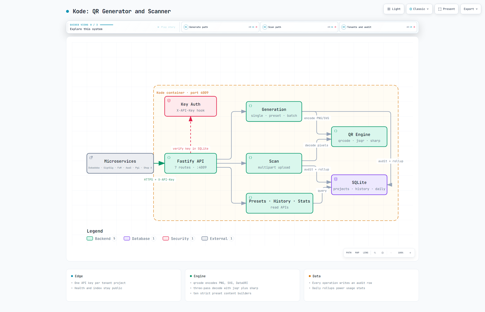

# Kode — Day 18

[](http://localhost:4009) [](https://nodejs.org) [](https://fastify.dev) [](https://sqlite.org) [](https://docs.docker.com/compose/)

**Local:** `http://localhost:4009` — `GET /` → `{"service":"Kode","version":"1.0.0",...}` | `GET /health` → `{"status":"ok",...}`

Centralized QR generation + scanning microservice. **Node.js + Fastify + SQLite + qrcode + jsqr + Sharp**. One QR engine for the 30 Services challenge.

> **Docs:** [Interactive Architecture](kode-architecture.html) • [Project Overview](docs/1.%20Project%20Overview.md) • [Architecture](docs/2.%20Architecture%20Overview.md) • [Workflows](docs/3.%20Workflow%20Overview.md) • [API](docs/5.%20API%20Reference.md) • [Operations](docs/6.%20Operations.md) • [TDS](Kode.md)

## Architecture — Interactive + Big Preview

[](kode-architecture.html)

> **Big preview** (2048×1320 light — 165 KB) — click for interactive pan/zoom/trace + light/dark + PNG export. Also available: [dark variant](kode-architecture.visual-check.2048x1320.dark.png) & [1440×900 light](kode-architecture.visual-check.1440x900.light.png). Full showcase: 9/9 checks, 0 errors. Spec: [kode.architecture.json](kode.architecture.json)

## Stack
- **Runtime:** Node.js 20+
- **Framework:** Fastify 4 (schema validation, hooks, multipart)
- **QR Generate:** `qrcode` (PNG/SVG/DataURI)
- **QR Decode:** `jsqr` (pure JS) + **Sharp** (any format → raw RGBA, logo composite)
- **DB:** SQLite via `better-sqlite3` (WAL + FK, zero-config)
- **Auth:** `X-API-Key` header → per-project keys + defaults

## Project Structure
```
.
├── src/server.js                # Fastify bootstrap + public / + /health
├── src/config.js                # env with defaults for every key
├── src/db.js                    # projects + history + daily rollups
├── src/migrate.js               # idempotent boot migration
├── src/seed.js                  # Dobadoba + Gig4Gig API keys
├── src/qr/generator.js          # PNG/SVG/DataURI + logo embed (forces H)
├── src/qr/scanner.js            # multi-pass decode (normal → inverted → upscaled)
├── src/qr/presets.js            # 10 builders: url text wifi vcard email sms tel geo upi momo
├── src/routes/generate.js       # POST /qr/generate, /preset, /batch
├── src/routes/scan.js           # POST /qr/scan (multipart file)
├── src/routes/presets.js        # GET /qr/presets
├── src/routes/history.js        # GET /qr/history (filter + paginate)
├── src/routes/stats.js          # GET /qr/stats (daily + by_preset)
├── src/middleware/auth.js       # X-API-Key gate (preHandler hook)
├── migrations/0001_init.sql     # projects + qr_history + daily_summary + indexes
├── scripts/test-local.js        # 19-check suite (35/35 incl. edge + logo)
├── docs/                        # 9 files: overview, C4, workflows, deep dives, API, ops
├── kode.architecture.json       # Archify spec (showcase 9/9)
├── kode-architecture.html       # interactive diagram + visual-check sidecars
├── Dockerfile                   # node:20-slim + libvips, sepia Linux build
├── docker-compose.yml           # 4009:4009 + kode_data volume
├── .dockerignore                # never ship host node_modules (ELF fix)
├── ecosystem.config.js          # PM2 alternative
├── .env.example                 # → .env (local config, gitignored)
├── Kode.md                      # TDS v1.0.0
└── README.md
```

## Quick Start (10 mins)

```bash
# 1. Install
npm install

# 2. Configure
# .env already has working defaults; override as needed

# 3. Migrate + seed
npm run migrate
npm run seed
# → Dobadoba (dobadoba-qr-key-2026) + Gig4Gig (gig4gig-qr-key-2026)

# 4. Run
npm start
# → http://localhost:4009/health {"status":"ok",...}

# 5. Test (19 core + 15 edge + logo = 35/35)
node scripts/test-local.js

# ——— OR Docker ———
docker compose up --build -d
docker exec kode node src/seed.js   # one-time per fresh volume
node scripts/test-local.js          # same suite, against the container
```

## API

All `/qr/*` need `X-API-Key`. Base: `http://localhost:4009` — full spec in [docs/5. API Reference.md](docs/5.%20API%20Reference.md)

### POST /qr/generate
```json
{ "data": "https://dobadoba.com/pay/TXN-12345", "format": "png", "size": 400 }
```
Binary `png`/`svg` (+ `X-QR-*` headers) | `{data_uri, base64, ...}` for `datauri` | `{base64, ...}` for `json` — `400` empty/oversize/bad EC

### POST /qr/generate/preset ⭐ (smart builders)
```json
{ "preset": "wifi", "payload": { "ssid": "Dobadoba-Guest", "password": "welcome2026" } }
```
`wifi vcard url email sms tel geo upi momo text` — strict server-side formats, no client string assembly | `400` unknown preset / missing field

### POST /qr/generate/batch
```json
{ "items": [{ "preset": "url", "payload": { "url": "..." }, "format": "datauri" }] }
```
Up to 50 mixed items, always `200` → `{total, succeeded, duration_ms, results}` — one bad item never fails the batch | `400` over 50

### POST /qr/scan ⭐ (decode uploads)
```
Content-Type: multipart/form-data, field "file"
```
`200` → `{data, data_length, image, location, duration_ms}` | `422` no QR found | `400` no file | `500` unreadable

### GET /qr/presets
`200` → `{presets: [{name, fields}], count: 10}`

### GET /qr/history
`?limit&offset&operation&preset&status&search&from_date&to_date` → `{entries, pagination}` (limit clamped to 100)

### GET /qr/stats?days=30
`200` → `{daily, totals: {generated, scanned, failed, total_output_bytes}, by_preset}` (days clamped to 365)

### GET / , GET /health
Public — endpoint catalogue + `{status:"ok", version:"1.0.0", timestamp}`

## Testing (cURL) — Local

```bash
BASE="http://localhost:4009"
KEY="dobadoba-qr-key-2026"

# generate PNG
curl -X POST $BASE/qr/generate -H "X-API-Key: $KEY" \
  -H "Content-Type: application/json" \
  -d '{"data":"https://dobadoba.com/pay/TXN-12345","size":400}' \
  --output pay.png

# DataURI (embed-ready)
curl -X POST $BASE/qr/generate -H "X-API-Key: $KEY" \
  -H "Content-Type: application/json" \
  -d '{"data":"Hello, world!","format":"datauri"}'

# WiFi preset
curl -X POST $BASE/qr/generate/preset -H "X-API-Key: $KEY" \
  -H "Content-Type: application/json" \
  -d '{"preset":"wifi","payload":{"ssid":"Dobadoba-Guest","password":"welcome2026"}}' \
  --output wifi.png

# Mobile-money preset
curl -X POST $BASE/qr/generate/preset -H "X-API-Key: $KEY" \
  -H "Content-Type: application/json" \
  -d '{"preset":"momo","payload":{"phone":"+265888123456","provider":"airtel","amount":15000,"currency":"MWK"}}' \
  --output momo.png

# batch
curl -X POST $BASE/qr/generate/batch -H "X-API-Key: $KEY" \
  -H "Content-Type: application/json" \
  -d '{"items":[{"preset":"url","payload":{"url":"https://dobadoba.com/order/1"},"format":"datauri"},{"preset":"tel","payload":{"phone":"+265888111222"},"format":"datauri"}]}'

# scan round-trip (decodes to https://dobadoba.com/pay/TXN-12345)
curl -X POST $BASE/qr/scan -H "X-API-Key: $KEY" -F "file=@pay.png"

# presets + stats
curl "$BASE/qr/presets" -H "X-API-Key: $KEY"
curl "$BASE/qr/stats?days=30" -H "X-API-Key: $KEY"
```

## Integration (for Dobadoba, Gig4Gig, AaaS etc.)

1. `POST {KODE_URL}/qr/generate/preset` with `X-API-Key` + `{preset, payload, format: "datauri"}`
2. Embed `data_uri` straight into HTML/email, or save binary `png` for print
3. For uploads: `POST {KODE_URL}/qr/scan` as multipart `file` → use `data`
4. Per-service keys isolate history — issue one key per consumer service

```typescript
// Dobadoba — payment QR
const r = await fetch(`${KODE_URL}/qr/generate/preset`, { method: 'POST',
  headers: { 'X-API-Key': KODE_KEY, 'Content-Type': 'application/json' },
  body: JSON.stringify({ preset: 'url', payload: { url: `https://dobadoba.com/pay/${tx_ref}` }, format: 'datauri', size: 400 }) });
const { data_uri } = await r.json();

// AaaS — TOTP enrollment SVG
// POST /qr/generate { data: `otpauth://totp/AaaS:${email}?secret=${s}&issuer=AaaS`, format: 'svg', size: 300 }
```

## Security Notes

- Auth: `X-API-Key` per project, `is_active` kill-switch, 401 before any handler
- Uploads: 10 MB cap + 4096px dimension cap (decompression-bomb protection)
- Validation: Fastify schemas clamp size (100–2000), margin, EC enum, batch ≤ 50
- History stores 200-char preview only — full payloads never touch disk
- No secrets in repo — `.env` is gitignored, configure via `.env.example`
- Logger never crashes boot (pino-pretty fallback, Windows-safe)

### Ponytail decisions (skipped → when to add)
- No ORM — direct `better-sqlite3` calls are shorter; add when queries outgrow helpers
- No test framework — plain-Node asserts, no fixtures; add vitest when suites need mocks
- No logo endpoint — `generateWithLogo` stays a library function (spec defines no route); add route when a client needs it
- No refresh/rotation for keys — static per-project keys; add rotation when a key leaks
- Fixed `better-sqlite3@12` over spec'd v9 — v9 has no Node 24 prebuilds; pin back when runtime changes
- `.dockerignore` excludes host `node_modules` — Windows binaries crash Linux (`invalid ELF header`); revisit never, it's load-bearing

## Deploy Checklist

- [ ] `.env` configured (or compose defaults accepted)
- [ ] `migrations/0001_init.sql` applied (`npm run migrate` / auto on boot)
- [ ] `npm run seed` executed (locally + `docker exec` per fresh volume)
- [ ] `docker compose up --build -d` healthy (`/health` → `ok`)
- [ ] `node scripts/test-local.js` → 19/19 green
- [ ] Port 4009 reachable from consumer services
- [ ] Share API key per service in WhatsApp

## License
MIT — reuse for all 30 services.
