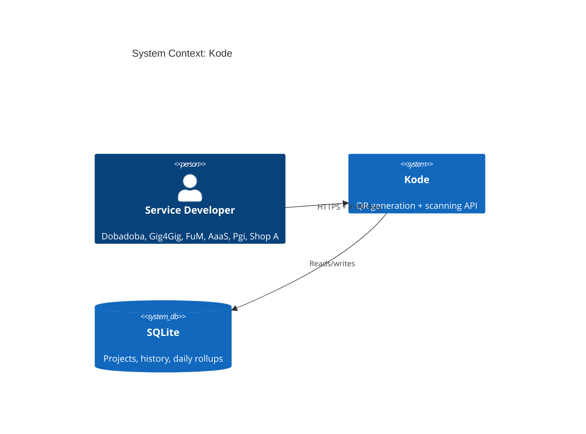
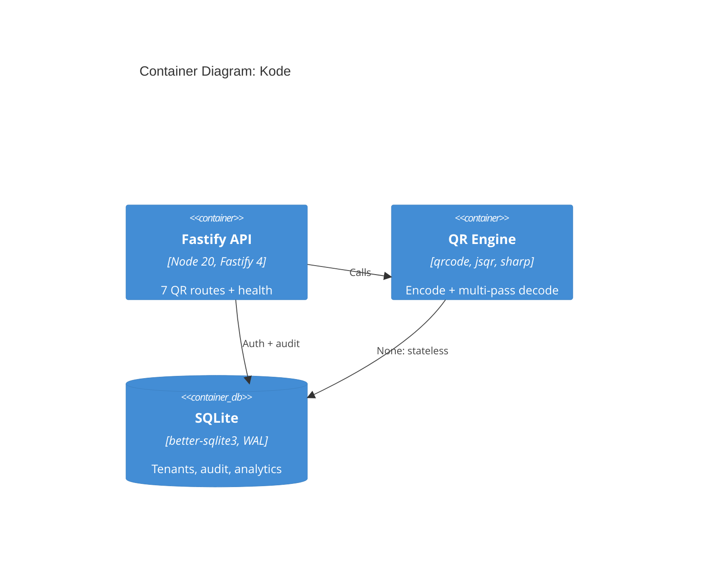
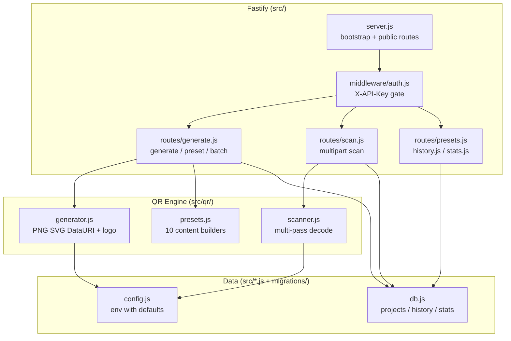

# Architecture Overview: Kode

## System Context (C4 Level 1)

Kode sits behind all platform microservices as the single QR authority.

Consumers never touch QR libraries directly: they POST data and get back an
image (or upload an image and get back data).

## Container Architecture (C4 Level 2)

Single deployable (or single Docker container + named volume for `/app/data`).
The engine is stateless; all state lives in SQLite.

## Component Architecture (C4 Level 3)

## Architectural Patterns

- **Layered**: routes → engine → data. Routes never touch SQLite except via
  `db.js` helpers; the engine never touches the DB at all.
- **Multi-tenant by key**: `preHandler` hook resolves the project once per
  request; project defaults flow into generation as fallbacks.
- **Audit-by-default**: every operation (success or failure) appends to
  `qr_history` and upserts `daily_summary`: analytics are a side effect, not a
  separate pipeline.
- **Presets as code**: WiFi/vCard/etc. formats are built server-side, so clients
  can't produce malformed payloads.

## Key Design Decisions

1. **`qrcode` over `qr-image`**: native SVG support, cleaner API.
2. **`jsqr` over `@zxing/library`**: pure JS, no async WASM load, faster for
   single images.
3. **Sharp for decode**: handles every input format, yields raw RGBA for jsqr;
   already vetted elsewhere in the platform.
4. **vCard 3.0, not 4.0**: wide device support; 4.0 still glitchy on older Android.
5. **Custom `momo://` scheme**: no universal mobile-money standard; Kode defines
   one Malawi wallets can adopt.
6. **Logo forces `H` correction**: logos obscure modules; high redundancy keeps
   codes scannable.
7. **4096 px scan cap + 10 MB upload cap**: decompression-bomb protection.
8. **`content_preview` (200 chars)**: searchable history without storing full data.

## Module Breakdown

### API (`src/server.js`, `src/routes/`, `src/middleware/`)
- Purpose: HTTP surface, auth gate, request validation, response shaping.
- Key files: `server.js`, `routes/generate.js` (largest, 308 lines: 3 endpoints),
  `routes/scan.js`, `routes/{presets,history,stats}.js`, `middleware/auth.js`.
- Depends on: QR engine, `db.js`, `config.js`.

### QR Engine (`src/qr/`)
- Purpose: stateless encode/decode. No DB, no HTTP.
- Key files: `generator.js`, `scanner.js`, `presets.js`.
- Depends on: `qrcode`, `jsqr`, `sharp`, `config.js` (limits/defaults only).

### Data (`src/db.js`, `src/migrate.js`, `src/seed.js`, `migrations/`)
- Purpose: persistence, audit, analytics, tenant seeds.
- Depends on: `better-sqlite3`, `config.js` (DB path).
