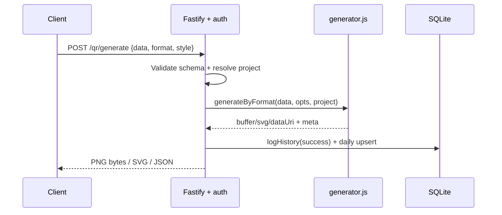
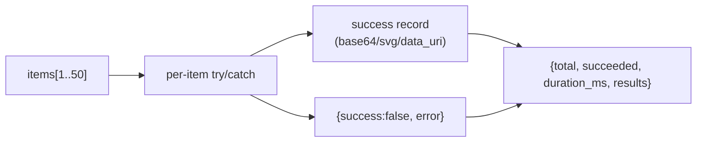
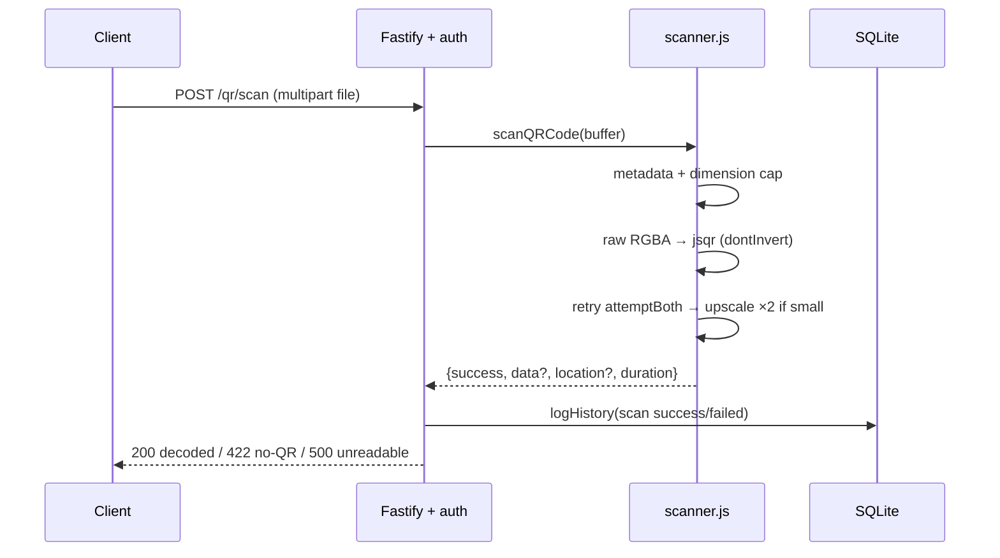
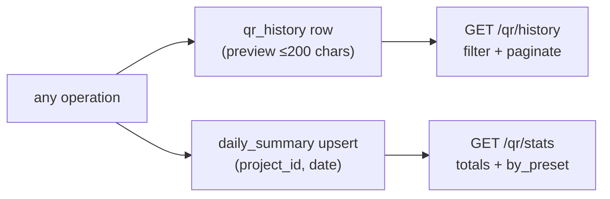

# Workflow Overview: Kode

## Generate (raw data)

Steps: auth → Fastify schema check → project defaults merged under explicit
options → EC-level length check → encode → audit → respond with format-specific
shape (binary PNG/SVG vs JSON for `datauri`/`json`).

## Generate (preset)

Same as above, with one extra first step: `buildPreset(preset, payload)`
assembles the strict content string (e.g. `WIFI:T:WPA;S:...;`, vCard 3.0 block,
`upi://pay?...`, `momo://pay?...`). Unknown preset or missing field → 400 +
failed audit row. Preset name and built content type are stored in history,
powering per-preset stats.

## Batch generate

Each item independently resolves (`data` or `preset`+`payload`), defaults to
`datauri` format, and writes its own audit row. One bad item never fails the
batch: HTTP 200 with per-item status. Schema caps the array at 50.

## Scan

Three-pass strategy catches inverted (light-on-dark) and small codes that
single-pass decoders miss. Corner locations are returned for overlay UIs.

## Data Flow (audit + analytics)

History is the raw journal; the daily table is the pre-aggregated rollup
(`generated_count`, `scanned_count`, `failed_count`, `total_output_bytes`).
`by_preset` is computed live from successful preset rows.

## Error Handling

- Validation (Fastify schemas): 400 with `FST_ERR_VALIDATION` detail.
- Domain errors (bad preset, oversize data, no QR found): 400/422 with
  `{error}`: and a `failed` audit row (except schema-level 400s, which reject
  before the handler runs).
- Unreadable uploads: 500 `{error: 'Scan failed', details}` + failed row.
- Auth: 401 `{error}` before any handler, nothing logged.
- Logger transport has a fallback so a broken `pino-pretty` can't crash boot.
