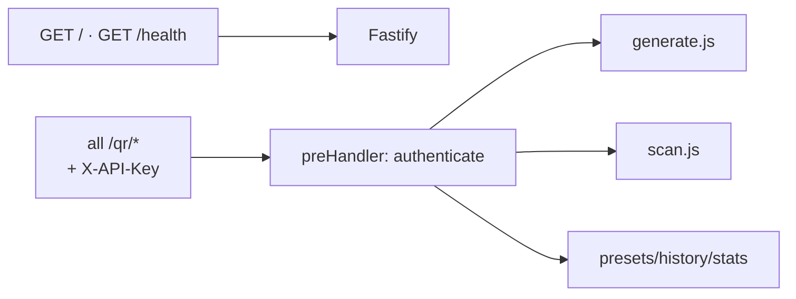

# Deep Dive: API Routes (`src/routes/`, `src/middleware/`, `src/server.js`)

## Auth (`middleware/auth.js`, 11 lines)

`preHandler` hook on the protected group: missing header → 401; unknown or
inactive key → 401; otherwise `request.project` carries the row (including
per-project defaults) into every handler. `/health` and `/` stay public.

## `generate.js` (308 lines: 3 endpoints)

- `POST /qr/generate`: schema requires `data` (min 1 char); `format` defaults
  `png`; `size` 100–2000; EC enum. Responds binary PNG (`Content-Disposition:
  inline`, `X-QR-*` headers), binary SVG, or JSON (`datauri`/`json`).
- `POST /qr/generate/preset`: requires `preset` + `payload`; builds content
  first, then shares the same format pipeline. Audit stores preset name.
- `POST /qr/generate/batch`: `items[1..50]` (schema-enforced); each item is
  independent try/catch, default format `datauri`; always HTTP 200 with
  `{total, succeeded, duration_ms, results}`.

Every path logs success *and* failure rows (preview, sizes, EC, duration, IP,
user agent, optional `metadata` passthrough on raw generate).

## `scan.js` (68 lines)

Accepts exactly one multipart `file` (size-capped). Empty field → 400; decoded
→ 200 `{data, data_length, image, location, duration_ms}`; no QR → 422;
unreadable → 500. Both scan outcome and handler errors are audited
(`scan_success`, `scan_duration_ms`).

## `presets.js` / `history.js` / `stats.js` (12 / 28 / 10 lines)

- `GET /qr/presets` → `{success, presets[{name, fields}], count}` (10).
- `GET /qr/history` → filters `operation preset status search from_date to_date`,
  `limit` clamped to 100, `{entries, pagination{total, limit, offset, has_more}}`.
- `GET /qr/stats` → `days` clamped to 365, `{days, daily[], totals, by_preset}`.

## `server.js` (94 lines)

Builds Fastify (body limit = image cap + 1 MB), registers CORS (open), Helmet
(no CSP, API-first), multipart (1 file, size-capped), initializes the DB, mounts
the authed group, exposes public `/health` (`{service, version, status,
timestamp}`) and `/` (endpoint catalogue + formats + presets). Graceful
`SIGINT`/`SIGTERM` close; logger falls back to plain pino if `pino-pretty`
transport fails (Windows-safe).

