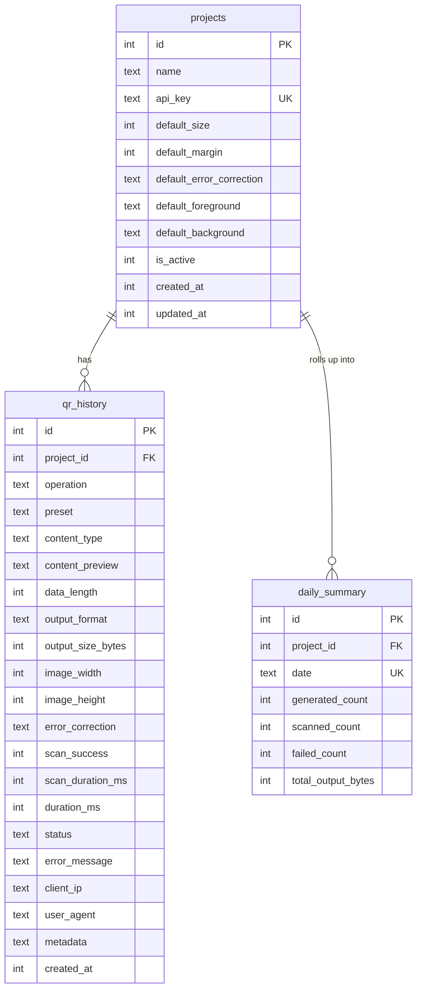

# Deep Dive: Data Layer (`src/db.js`, `migrations/`, `seed.js`)

## Schema (`migrations/0001_init.sql`, 75 lines)

Indexes on `api_key`, `(project_id)`, `(project_id, operation)`,
`(project_id, preset)`, `created_at`, and `(project_id, date)`: every hot
query path is covered. `UNIQUE(project_id, date)` makes the rollup upsert-safe.

## `db.js` (196 lines)

- `getDatabase()`: lazy singleton, creates parent dir, `journal_mode=WAL`,
  `foreign_keys=ON`, runs the migration file idempotently (`IF NOT EXISTS`
  everywhere, so boot is safe to repeat).
- `getProjectByApiKey`: single indexed lookup gated on `is_active`.
- `logHistory`: truncates preview to 200 chars, inserts the journal row, then
  upserts today's rollup (`generated` = non-scan success, `scanned` = scan
  success, `failed` = any failure). Auditing never throws past the caller:
  route handlers call it synchronously inside try/catch flows.
- `listHistory`: dynamic `WHERE` from optional filters + `LIKE` search, with
  separate `COUNT(*)` for pagination.
- `getStats`: last-N-days rollup rows + totals + live `by_preset` aggregation
  over successful preset rows.

## Seeds (`seed.js`, 30 lines)

Idempotent `INSERT OR IGNORE`: **Dobadoba** (`dobadoba-qr-key-2026`, 400 px/`M`)
and **Gig4Gig** (`gig4gig-qr-key-2026`, 500 px/`H`). Re-runnable safely.

## Notes

- Timestamps are epoch millis (`Date.now()`); day buckets are UTC `YYYY-MM-DD`.
- `metadata` is free-form JSON (stringified) for caller correlation IDs etc.
- DB path resolves relative to project root (`DATABASE_PATH`, default
  `./data/kode.db`; `/app/data/kode.db` in Docker via named volume).
